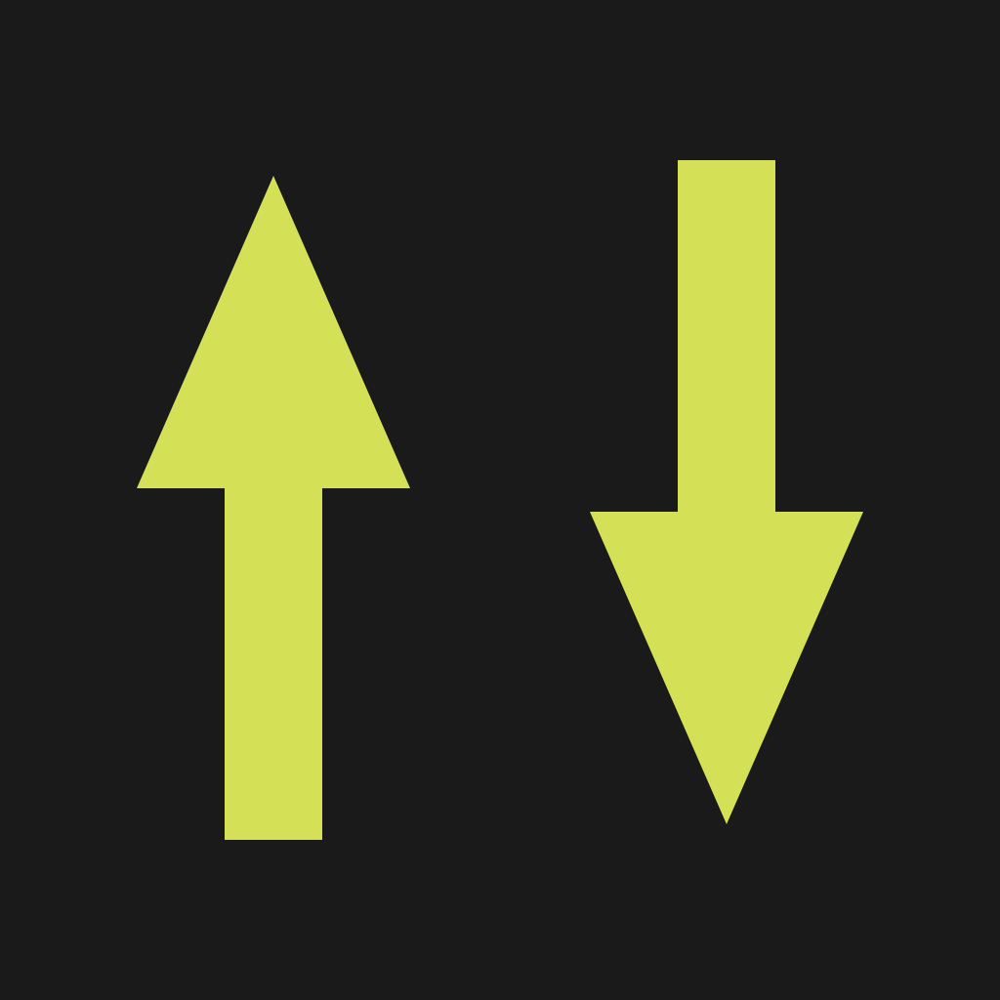

<div align="center">
  
  <br/><br/>
  <h1>PALT</h1>
  <p><b>P</b>eer <b>A</b>nd <b>L</b>ocal <b>T</b>ransfer</p>
  <p>Frictionless, high-speed local network file transfer — Linux Desktop and Android.</p>

  [](https://github.com/h200137j/palt/actions/workflows/release.yml)
</div>

---

PALT bridges Desktop and Mobile over raw TCP. No USB cables, no cloud uploads — it detects sibling devices over the local network via `mDNS` and streams files point-to-point at full network speed.

Powered by **Go** and **Wails** on Desktop, **Flutter** on Mobile.

---

## Design

**Concrete Lemon** — brutalist restraint with a lemon accent.

| Token | Value |
|---|---|
| Primary | `#1A1A1A` |
| Secondary | `#6B6B6B` |
| Accent | `#D4E157` |
| Neutral | `#D9D6D0` |
| Surface | `#F0EDE6` |
| Font | Archivo / Archivo Narrow |

Flat. No gradients. No shadows. Single accent per screen.

---

## Features

- **Blazing Fast TCP:** Core transfer runs strictly over local interfaces — unthrottled, no cloud hops.
- **Zero-Config Discovery:** ZeroConf / mDNS (`_palt._tcp.local.`) — devices see each other the moment the app opens.
- **Cross-Platform:** Linux Desktop (Wails + React + MUI) and Android (Flutter + Material 3 + Riverpod).
- **Inbound Safety:** Manual accept/reject handshake on every incoming transfer.
- **Native Downloads:** Received files land directly in the Android public `Downloads` directory.

---

## Architecture

```
palt/
├── .github/workflows/     # CI/CD — .apk and .deb release automation
├── assets/                # Shared assets (icon.svg source)
├── desktop/               # Wails Linux app
│   ├── main.go
│   ├── app.go             # Wails bindings
│   └── internal/
│       ├── discovery/     # mDNS advertiser + browser
│       └── transfer/      # Raw TCP chunked streamer
│   └── frontend/          # Vite + React + MUI
│
└── mobile/                # Flutter Android app
    ├── assets/icon.png
    └── lib/
        ├── theme/         # Concrete Lemon design tokens
        ├── ui/            # Screens & widgets
        ├── services/      # Android NSD + socket streaming
        └── providers/     # Riverpod state
```

---

## Building from Source

### Prerequisites

| Platform | Required |
|---|---|
| Desktop | Go ≥ 1.21, Node.js ≥ 18, [Wails v2 CLI](https://wails.io/docs/gettingstarted/installation/) |
| Linux deps | `sudo apt install libgtk-3-dev libwebkit2gtk-4.1-dev build-essential` |
| Mobile | Flutter SDK ≥ 3.19, Android Studio or CLI tools |

### Desktop (Linux)

```bash
cd desktop
go mod tidy
wails dev -tags webkit2_41          # dev mode (live reload)
wails build -platform linux/amd64 -tags webkit2_41  # release binary
```

### Mobile (Android)

```bash
cd mobile
flutter pub get
flutter run
```

---

## Technical Notes

**Android hostname:** Modern Android returns `localhost` for `Platform.localHostname`. PALT queries the HAL via `device_info_plus` for real model designations (e.g. *SM-S938B*) and uses IP-based deduplication instead of hostname strings.

**Discovery lifecycle:** All peers broadcast on port `9876`. TXT records carry OS signatures (`linux`, `android`) for platform icon injection. Dead peers are reaped via TTL (Go) or `removeWhere` on multicast drop (Dart).

---

<div align="center">
  <sub>Built by <a href="https://github.com/h200137j">uriel</a> · v1.1.0</sub>
</div>
